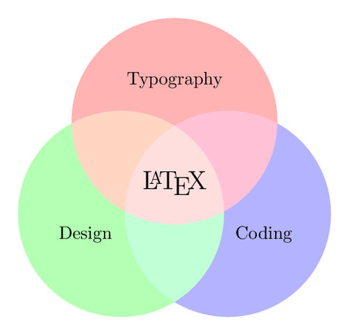

---
# Just for example purposes, a random lorem ipsum text for the abstract
header-includes:
    - \usepackage{blindtext}
# Basic variables
title: 'Title'
author: Author
date: \today
lang: en
abstract: \blindtext
# If custom title is commented, pandoc should show the standard title
# custom-titlepage: exampletitlepage
# Global options
mainfont: Arial
monofont: Fira Mono # Checkout https://github.com/tonsky/FiraCode
fontsize: 11pt
linestretch: 1
geometry: "a4paper, top=2.5cm, bottom=2.5cm, left=3cm, right=3cm"
# Bibliography file and options
bibliography: references.bib
link-citations: true
# Citation Style Language
csl: ieee.csl
# Table of contents
toc: true
# Number sections
numbersections: true
# List of figures
lof: true
# List of tables
lot: false
# If there is only latex-style images, uncomment the following line
# graphics: true
# graphics-path: /path/to/image/folder
---

# Section Example

Referencing example @ref-name.

## Subsection example

This is a figure example (figures \ref{fig:example-latex}, \ref{fig:example-markdown}).

\begin{figure}[H]
    \centering
    \caption{Figure example.\label{fig:example-latex}}
    \includegraphics[width=0.5\textwidth]{./img/example.png}
\end{figure}

Another way of including an image:

{width=50%}

## Verbatim (code) blocs

### Indented

    if (a > 3) {
        moveShip(5 * gravity, DOWN);
    }

### Fenced / backtic

It is the same to use ~ or `` ` ``

~~~ {.python .numberLines startFrom="0"}
x = None
if x is None:
    print('None')
~~~

simple one:

```python
x = None
if x is None:
    print('None')
```

## Lists

* First paragraph.

  Continued.

* Second paragraph. With a code block, which must be indented
  eight spaces:

      { code }

### Ordered lists

1. first
2. second
10. third

#### Fancy lists

#. one
#. two

#### StartNum

9)  Ninth
10)  Tenth
11)  Eleventh
      i. subone
     ii. subtwo
    iii. subthree

## Tables

### Simple tables

  Right     Left     Center     Default
-------     ------ ----------   -------
     12     12        12            12
    123     123       123          123
      1     1          1             1

Table:  Demonstration of simple table syntax.

<!--  -->

-------     ------ ----------   -------
     12     12        12             12
    123     123       123           123
      1     1          1              1
-------     ------ ----------   -------

### Multi line tables

-------------------------------------------------------------
 Centered   Default           Right Left
  Header    Aligned         Aligned Aligned
----------- ------- --------------- -------------------------
   First    row                12.0 Example of a row that
                                    spans multiple lines.

  Second    row                 5.0 Here's another one. Note
                                    the blank line between
                                    rows.
-------------------------------------------------------------

Table: Here's the caption. It, too, may span
multiple lines.

<!--  -->

----------- ------- --------------- -------------------------
   First    row                12.0 Example of a row that
                                    spans multiple lines.

  Second    row                 5.0 Here's another one. Note
                                    the blank line between
                                    rows.
----------- ------- --------------- -------------------------

: Here's a multiline table without headers.

### Grid tables

: Sample grid table.

+---------------+---------------+--------------------+
| Fruit         | Price         | Advantages         |
+===============+===============+====================+
| Bananas       | $1.34         | - built-in wrapper |
|               |               | - bright color     |
+---------------+---------------+--------------------+
| Oranges       | $2.10         | - cures scurvy     |
|               |               | - tasty            |
+---------------+---------------+--------------------+

<!--  -->

+---------------+---------------+--------------------+
| Right         | Left          | Centered           |
+==============:+:==============+:==================:+
| Bananas       | $1.34         | built-in wrapper   |
+---------------+---------------+--------------------+

<!--  -->

+--------------:+:--------------+:------------------:+
| Right         | Left          | Centered           |
+---------------+---------------+--------------------+

### Pipe tables

| Right | Left | Default | Center |
|------:|:-----|---------|:------:|
|   12  |  12  |    12   |    12  |
|  123  |  123 |   123   |   123  |
|    1  |    1 |     1   |     1  |

: Demonstration of pipe table syntax.

<!--  -->

fruit| price
-----|-----:
apple|2.05
pear|1.37
orange|3.09

## Text style

H~2~O is a liquid.  2^10^ is 1024.

[Small caps]{.smallcaps}

## Foot notes

Here is a footnote reference,[^1] and another.[^longnote]

[^1]: Here is the footnote.

[^longnote]: Here's one with multiple blocks.

    Subsequent paragraphs are indented to show that they
belong to the previous footnote.

        { some.code }

    The whole paragraph can be indented, or just the first
    line.  In this way, multi-paragraph footnotes work like
    multi-paragraph list items.

This paragraph won't be part of the note, because it
isn't indented.

## Inline notes

Here is an inline note.^[Inlines notes are easier to write, since
you don't have to pick an identifier and move down to type the
note.]

# References section
